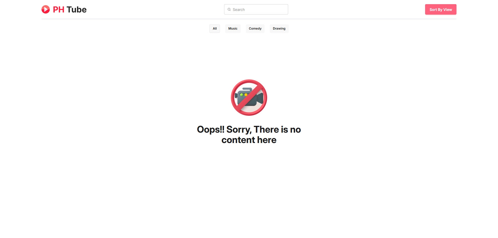
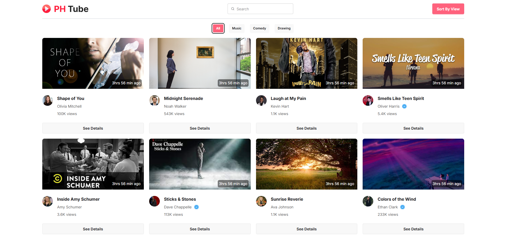
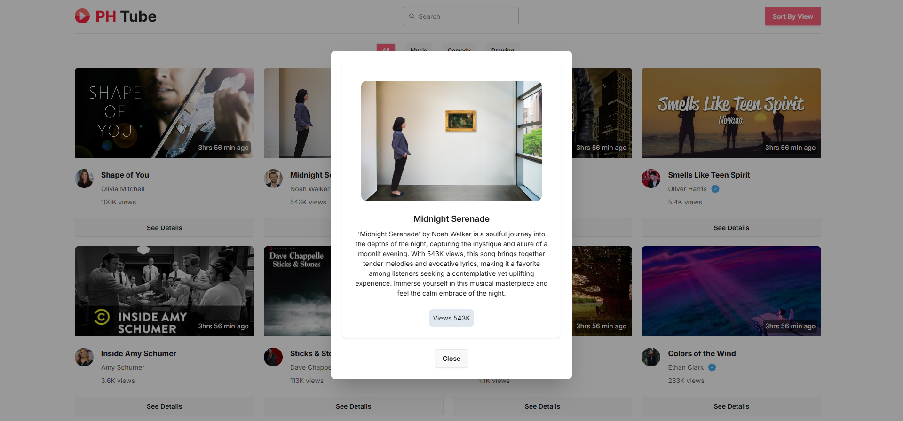

# PH Tube

PH Tube is a simple web application that allows users to browse and view video content. The application is built using HTML, CSS (Tailwind & DaisyUI), and JavaScript. It utilizes an API to fetch and display video categories and videos dynamically.

## Features

* Fetch and display video categories dynamically
* Load videos based on search queries
* Sort videos by views
* Display video details in a modal
* Show a loading spinner while fetching data
## Technologies Used

* HTML5
* CSS3 (Tailwind CSS, DaisyUI)
* JavaScript (ES6+)
* Fetch API
## Live Demo
image
[Live Demo](https://tanmoydhar1077.github.io/PH-Tube-Use-API-Calling/)
## Screenshots





## Project Structure
```
PH Tube/
│── assets/
│   ├── img/             # Images and icons
│   ├── js/              # JavaScript files
│   │   ├── main.js      # Main JavaScript file
│── index.html           # Main HTML file
│── README.md            # Project documentation
```
## Installation

* Clone the repository: 
```bash
https://github.com/TanmoyDhar1077/PH-Tube-Use-API-Calling.git
```
* Navigate to the project directory: 
```bash
cd ph-tube
```
* Open `index.html` in your browser. You can use a live server extension if you're using Visual Studio Code.

## Usage
* The homepage loads categories and displays a default video list.
* Users can search for videos using the search bar.
* Clicking a category button loads videos specific to that category.
* Clicking on a video opens a modal with more details.

## API Reference

#### Get all videos

```
  https://openapi.programming-hero.com/api/phero-tube/videos
```

#### Get Categories

```
  https://openapi.programming-hero.com/api/phero-tube/categories
```

### Get Video based on Catagory [ params ]

 **Endpoint :** 
```
    https://openapi.programming-hero.com/api/phero-tube/category/categoryId
```
**Example :**
```
  https://openapi.programming-hero.com/api/phero-tube/category/1001
```

### Get Video based on Title [ Query ]

**Endpoint :** 
```
https://openapi.programming-hero.com/api/phero-tube/videos?title=videoTitle
```
**Example :**
```
https://openapi.programming-hero.com/api/phero-tube/videos?title=shape
```

### Get Video Details by video_id [ Query ]

**Endpoint :** 
```
https://openapi.programming-hero.com/api/phero-tube/video/video_id
```
**Example :** 
```
https://openapi.programming-hero.com/api/phero-tube/video/aaac
```


## Contributing
* Contributing
* Fork the repository
* Create a new branch (feature/your-feature)
* Commit your changes
* Push to the branch
* Open a pull request

## License

This project is licensed under the MIT License.
